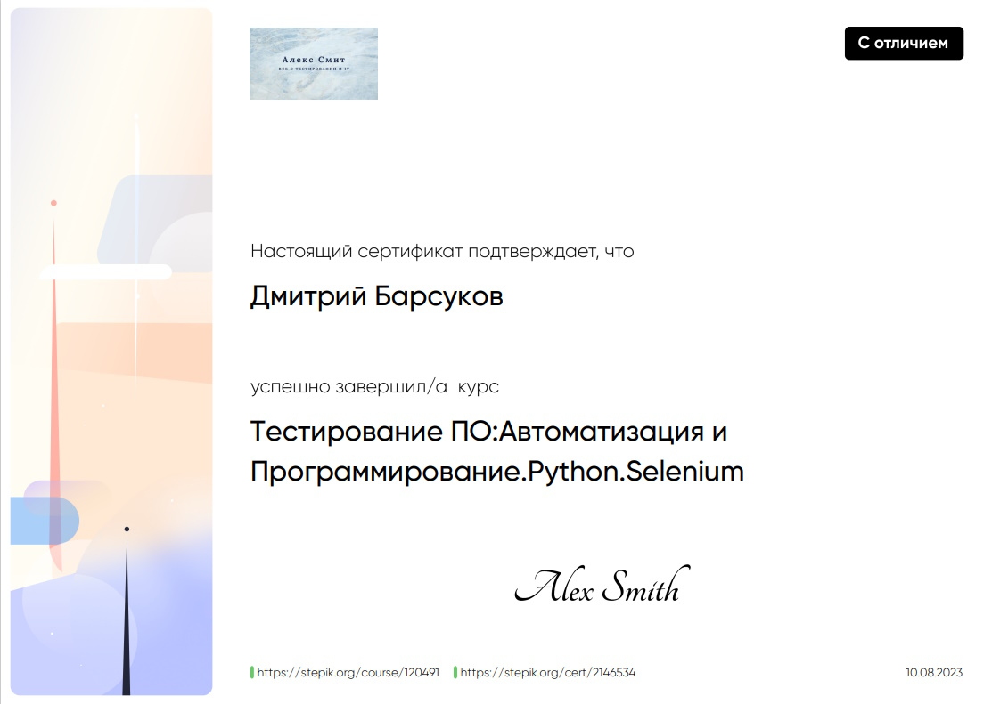

# UI Тесты интренет магазина [sad-i-ogorod.ru](https://sad-i-ogorod.ru/)

## Фреймворк PyTest
---
Структура каталогов проекта;

Проект содержит следующие основные каталоги:

`base` — Каталог с базовыми методами;

`pages` — Каталог с методами страниц сайта;

`tests` — Каталог с файлами авто тестов;

`utilites` — Каталог с внешними методами;

`requirements.txt` - это список всех модулей и пакетов Python, которые нужны для полноценной работы;  

Для того чтобы установить пакеты из requirements.txt, необходимо открыть командную строку, перейти в каталог проекта;
и ввести следующую команду: `pip install -r requirements.txt`

`test_card.py` - Тест логики ограничения суммы заказа.  

Заказ меньше 800:  
Отображается "Минимальная стоимость посылки 800.0".    
Кнопка "Перейти в каталог семян" кликабельна.   
Кнопка "Оформить заказ" не кликабельна.  
Не доступно оформление заказа.  

Заказ больше 800 и меньше 2000:   
Отображается "Бесплатная доставка от 2 000".    
Кнопка "Перейти в каталог семян" скрыта.  
Кнопка "Оформить заказ" кликабельна.  
Доступно оформление заказа.

Заказ больше 2000:  
Отображается "Бесплатная доставка". 
Кнопка "Перейти в каталог семян" скрыта.  
Кнопка "Оформить заказ" кликабельна.  
Доступно оформление заказа.  

`login_test.py` - Тест авторизации.  
Подтверждение факта авторизации:
Изменение текста на кнопки "Личный кабинет".  
Изменение URL.  

Запуск `python -m pytest -s -v`

-----------------------------------------

